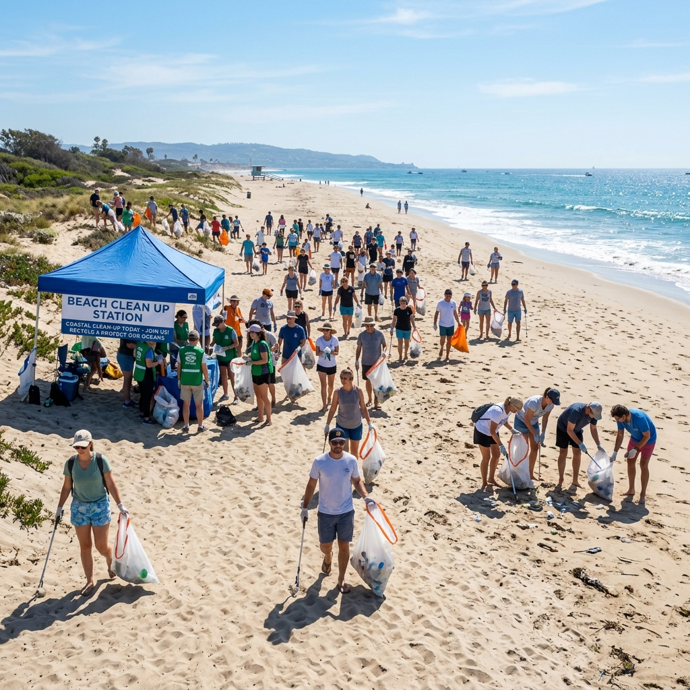
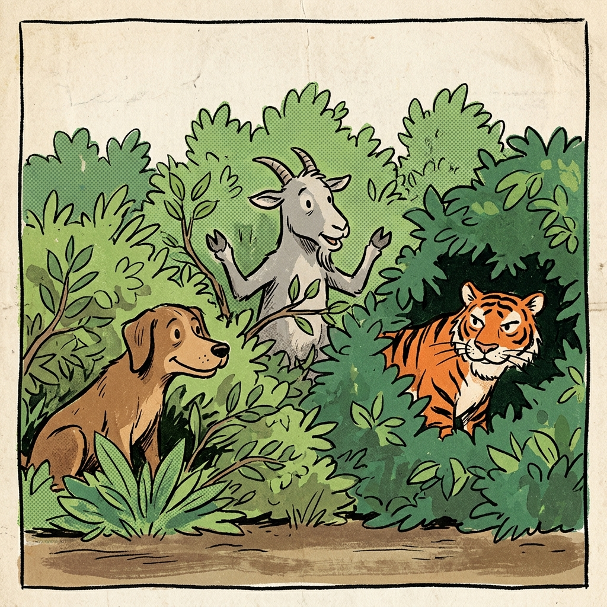

# The Balarama Gazette 🎯

## Basic Details
### Team Name: Fortons

### Team Members
- Team Lead: Rayhan KN - SOE CUSAT
- Member 2: Sreedhar Hari - SOE CUSAT

### Project Description
The Balarama Gazette: A Balarama-inspired online news reader where each page is locked behind a riddle or puzzle featuring Balarama characters. The puzzles get harder with every page, making reading the news progressively more frustrating by design.

### The Problem (that doesn't exist)
Reading the news today is way too quick and painless — readers get informed without any struggle, suspense, or sense of accomplishment. The Balarama Gazette proudly fixes this problem that nobody asked for, turning effortless news reading into a needlessly difficult ordeal.

### The Solution (that nobody asked for)
The Balarama Gazette locks every news page behind a riddle or puzzle featuring Balarama characters, with difficulty escalating page by page ensuring readers earn every headline through unnecessary struggle instead of just, you know, reading it. Features include Connect-the-Dots, Malayalam Jumble Words, Luttappi's Jokebox, and an AI Hand-Tracking Cricket Game!

## Technical Details
### Technologies/Components Used
For Software:
- **Languages used**: HTML, CSS, JS, PYTHON
- **Frameworks/Libraries used**: MediaPipe Tasks Vision (for AI Hand Tracking in the Sports section)
- **Vanilla HTML5**: Standard HTML without any templating engines.
- **Vanilla CSS3**: Custom, hand-written CSS directly embedded in the HTML file (`<style>` tag) rather than using frameworks like Tailwind, Bootstrap, or Material UI.
- **Vanilla JavaScript**: The interactive functionality and animations are written using standard DOM APIs within the `<script>` tags, without relying on libraries like React, Vue, jQuery, or GSAP.
- **Tools used**: Git, GitHub, Python (for local HTTP testing server)

### Implementation
For Software:
# Installation
1. Clone the repository to your local machine:
   ```bash
   git clone <your-repo-url>
   cd useless
   ```
2. No package installation is necessary as the project relies purely on vanilla JS and CDN imports!

# Run
1. Start a local HTTP server in the project directory (required for MediaPipe and modules to work due to CORS):
   ```bash
   python3 -m http.server 8080
   ```
2. Open your web browser and navigate to:
   ```
   http://localhost:8080
   ```

### Project Documentation
For Software:

# Screenshots


*The Front Page of The Balarama Gazette with jumbled breaking news.*



*The AI-Powered Cricket Game where you hold up 2 fingers to swing.*


*The highly satirical Classifieds section featuring vintage comics and characters.*

## Team Contributions
- **Rayhan KN**: Concept generation, layout design, content curation (riddles, news, and jokes), UI aesthetics, Frontend & Backend.
- **Sreedhar Hari**: Core frontend development, MediaPipe AI integration, logic for puzzles (Connect-the-dots, Jigsaw, Quiz), debugging, Frontend & UI/UX.

---
Made with ❤️ at TinkerHub Useless Projects 


